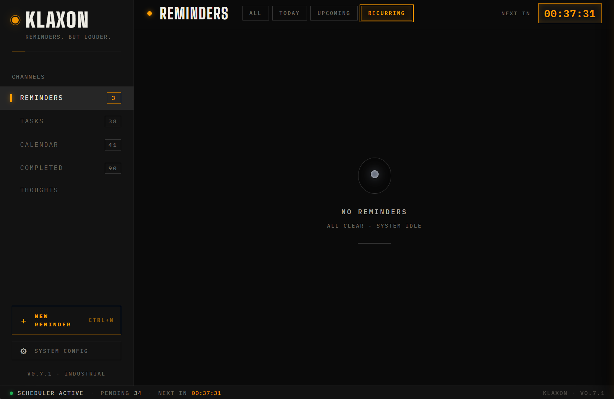
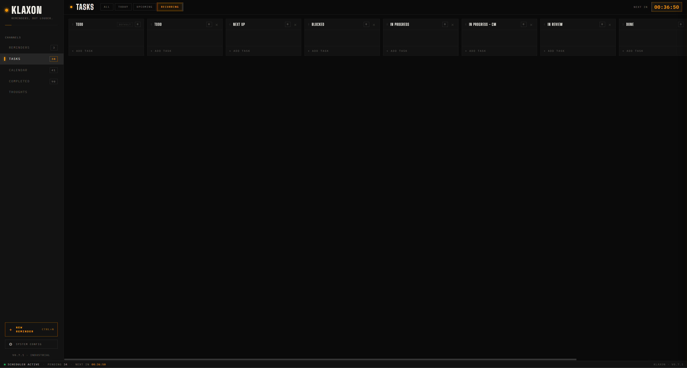

# Klaxon

> A self-hosted reminder app that actually gets your attention — and never touches anyone's cloud.

Klaxon is reminders, tasks, and a private thought inbox in one app, synced device-to-device with no server, no account, and no subscription. Reminders ring even when the app is closed. Your data is a SQLite file on your own machines, encrypted iroh traffic between them, and nothing anywhere else.

**Platforms:** Windows desktop + Android. Grab both from the [latest release](https://github.com/willherr72/Klaxon/releases/latest).

---

## Features

- **Reminders that escalate.** Three priority tiers — quiet toast, always-on-top popup with a repeating tone, fullscreen alarm. Configurable repeat count, interval, and tone per tier. Snooze presets or custom. Recurring: daily, weekdays, interval, monthly.
- **Rings cold.** A reminder created on your desktop rings on your phone even if Klaxon isn't running there — background sync arms real OS alarms. Late arrivals ring once within a 30-minute grace window; a reminder you dismiss anywhere goes quiet everywhere.
- **Tasks board.** Silent reminders organized in drag-and-drop swim lanes.
- **Thoughts inbox.** A permanent, searchable feed for ideas: global capture hotkey on desktop, share-to-Klaxon on Android, `#tags` inline, promote any thought into a task or reminder.
- **True peer-to-peer sync.** Devices pair with a 6-digit confirmation code and sync directly over [iroh](https://iroh.computer) — LAN when possible, encrypted relays when not. No store-and-forward server exists; only your devices ever hold your data.
- **Backups.** Automatic daily local snapshots, plus passphrase-encrypted full export/restore (Argon2id + AES-256-GCM) that resurrects a device completely — pairings included.
- **Self-updating.** Klaxon checks GitHub releases daily and installs updates on request, on both platforms.

## Screenshots

<!-- Blank-state captures; more coming. -->




---

## Install

### Windows

1. Download `Klaxon_<version>_x64-setup.exe` from the [latest release](https://github.com/willherr72/Klaxon/releases/latest).
2. Run it. **Windows will show "Windows protected your PC"** — that's SmartScreen reacting to a self-signed installer, which is normal for a self-hosted app that doesn't buy a yearly code-signing certificate. Click **More info → Run anyway**.
3. That's the last installer you run by hand: from then on Klaxon updates itself (Settings → System shows new releases).

### Android

1. Download `klaxon-<version>-arm64.apk` from the [latest release](https://github.com/willherr72/Klaxon/releases/latest) on the phone and open it.
2. Android asks you to allow installs from your browser/file manager — one-time.
3. On the first in-app update, Android asks once more to allow installs **from Klaxon** — that's what lets it update itself from then on.

### Staying updated

Klaxon checks for new releases quietly (on launch and daily) and shows a hint in the status bar plus an update panel in Settings → System. One tap downloads the right artifact and hands it to the OS installer — nothing installs silently. **Keep both devices current:** the sync wire format can change between releases, and Klaxon warns you when a paired device looks outdated.

## Pairing two devices

1. Open **Settings → Sync** on both devices (same Wi-Fi makes discovery automatic; a remote device can be added by its `iroh://` node id).
2. Pick the discovered device and start pairing.
3. Both screens show the same 6-digit code — confirm on each.
4. Done. Reminders, tasks, and thoughts flow both ways from then on, including while one side is asleep — the next wake catches up, over LAN or relay, wherever you are.

## Backups

- **Snapshots:** once a day Klaxon copies its database into `backups/` (newest 7 kept) — plain SQLite files, restorable with a file manager.
- **Export:** Settings → System → Export backup writes a single passphrase-encrypted `.klaxonbak` containing the database *and* the device's sync identity. Restoring it makes a machine *be* the old device, pairings intact. There is no passphrase recovery — keep it safe. Never restore one identity onto two live devices.

## Privacy model

What leaves a device, exhaustively:

- **Sync traffic to your own paired peers**, end-to-end encrypted by iroh. When no direct path exists, it flows through n0's public relays, which see only encrypted bytes.
- **A release check to `api.github.com`** (unauthenticated, roughly daily) and the release download when you ask for an update.

There is no telemetry, no account, no analytics, and no server of ours anywhere.

---

## Build from source

### Prerequisites

- [Rust](https://rustup.rs/) 1.77+
- [Node.js](https://nodejs.org/) 20+
- Tauri 2 platform prerequisites — see [Tauri docs](https://tauri.app/start/prerequisites/)

**Windows:** WebView2 runtime (already on Windows 11).

**Linux** (Debian/Ubuntu):
```bash
sudo apt update
sudo apt install -y \
  libwebkit2gtk-4.1-dev \
  libssl-dev \
  libgtk-3-dev \
  librsvg2-dev \
  libxdo-dev \
  build-essential \
  curl wget file
```

(For Fedora / Arch see the [Tauri prerequisites page](https://tauri.app/start/prerequisites/#linux).)

**Android** (only needed for mobile builds):

- Android SDK + NDK, with `ANDROID_HOME` and `NDK_HOME` set
- **JDK 17–21.** Not newer: the Android Gradle Plugin pinned in
  `src-tauri/gen/android/buildSrc` fails to configure under JDK 25 with a bare
  `A problem occurred configuring project ':buildSrc'. > 25.0.2`, which doesn't
  name Java as the cause. If Android Studio is installed, its bundled runtime is
  a suitable JDK 21 and needs no separate download.

```bash
# Point Gradle at a supported JDK for the build only, leaving your
# system-wide JAVA_HOME alone.
export JAVA_HOME="/c/Program Files/Android/Android Studio/jbr"
export ANDROID_HOME="$LOCALAPPDATA/Android/Sdk"
export NDK_HOME="$ANDROID_HOME/ndk/<version>"
npm run tauri android build -- --debug
```

Note the Rust side compiles before Gradle runs, so a `Finished dev profile`
line followed by a Gradle failure means the Rust cross-compile succeeded and
only packaging failed.

### Run in development

```bash
git clone https://github.com/willherr72/Klaxon
cd Klaxon
npm install
npm run tauri dev
```

### Build a release installer

```bash
npm run tauri build
```

Outputs land in `src-tauri/target/release/bundle/`:
- **Windows:** `nsis/Klaxon_<version>_x64-setup.exe`
- **Linux:** `deb/klaxon_<version>_amd64.deb` + `appimage/Klaxon_<version>_amd64.AppImage`

First run takes several minutes for the full release compile; subsequent builds are incremental.

### Tests

```bash
npm run build       # cargo test needs ../dist to exist
cd src-tauri
cargo test
```

## Configuration

Klaxon stores its database, settings, sync identity, and backups in your platform's app-data directory under `com.klaxon.app/`:

- **Windows** — `%APPDATA%\com.klaxon.app\`
- **macOS** — `~/Library/Application Support/com.klaxon.app/`
- **Linux** — `~/.config/com.klaxon.app/`

---

## Contributing

Early-stage personal project — pull requests and issues are welcome but there's no formal process yet. Open an issue to discuss anything substantial before sending a PR. Bug reports and design feedback are especially appreciated.

---

## License

MIT — see [LICENSE](LICENSE).
